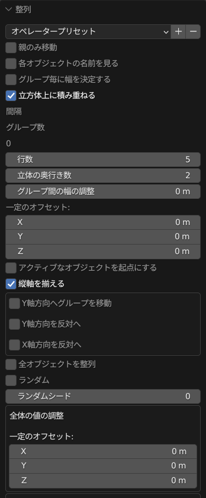
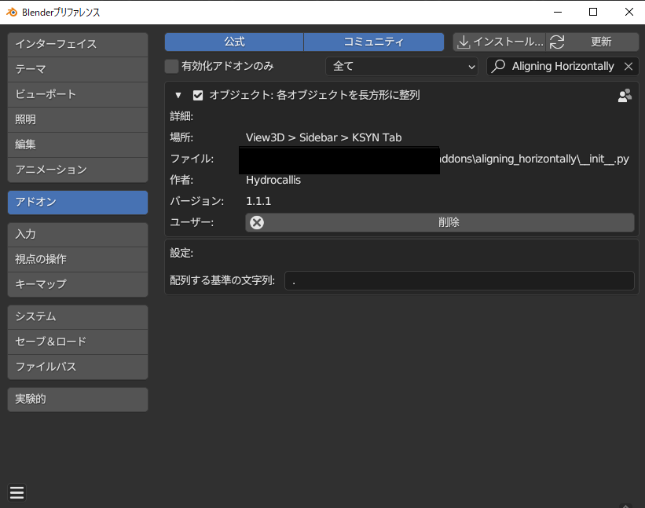

.. _ah:

############################
AHの様々な機能　　　　
############################

.. _interface:

================
インターフェース
================

このアドオンはオブジェクト郡のY軸とX軸を基準にオブジェクト郡が等間隔で配列されるアドオンです。

使用用途して、樽の積み重ね。窓の配列など、
オブジェクトをアレイモディファイアなどを使わずに
等間隔で配列したい際に有効なアドオンとなっております。
ぜひ活用して下さい。

.. _all_objects:

========================
全体のオブジェクトを配列
========================
.. figure:: aH_align_all_objects.mp4
    :width: 500
    :height: 300
    :class: controls

全体のオブジェクトを配列するチェックボタンを押すと、
通常であればグループ毎の（例えば、cube.001 cube.002 とplane.001 plane.002などのグループ）配列が
統合されて配列されます。

.. _平面配列:

==========
平面配列
==========
.. figure:: aH_align_gropu_heimen.mp4
    :width: 500
    :height: 300
    :class: controls

デフォルトでは立体的にオブジェクトが積み上がりますが、
このボタンをクリックすると平面上にオブジェクトが配列されます。

.. _グループ配列:

==============
グループ配列
==============
.. figure:: aH_align_group.mp4
    :width: 500
    :height: 300
    :class: controls

デフォルトの設定ではオブジェクト名のグループ毎に配列されます。
（例えば、cube.001 cube.002 とplane.001 plane.002などのグループ）

配列の幅の基準がオブジェクト郡のX軸とY軸の幅の最大値から算出されます。

カメラやライトは幅という概念がないので、０ｍとして算出されます。

.. _デフォルに戻すには:

============================
デフォルに戻すには
============================
.. figure:: aH_default.mp4
    :width: 500
    :height: 300
    :class: controls

プロパティの設定をすべて戻したい場合はオペレータープリセットからデフォルトを選んでください。

オペレータープリセットのオプションを用意してますので、
お好みの設定があれば設定の保存もここで行えます。

.. _親のみ移動する:

============================
親のみ移動する
============================
.. figure:: aH_parent.mp4
    :width: 500
    :height: 300
    :class: controls

選択したオブジェクトに親子関係がある場合はこちらのオプションをONにしてもらえば、
親のみが移動の対象となるので親子関係の位置関係がリセットされません。

.. _グループの連番の基準に文字:

============================
グループの連番の基準に文字
============================

.. figure:: aH_align_kijunn.mp4
    :width: 500
    :height: 300
    :class: controls

各グループの連番はデフォルトでは

.(ピリオド)

を基準にソートされます。
例えば、

+------------------+------------+
| **Group Name**   |**Elements**|
+------------------+------------+
| Cube Group       | cube.001   |
|                  | cube.002   |
+------------------+------------+
| Plane Group      | plane.001  |
|                  | plane.002  |
+------------------+------------+
| Sphere Group     | sphere.001 |
|                  | sphere.002 |
+------------------+------------+
| Camera Group     | camera.001 |
|                  | camera.002 |
+------------------+------------+

                         

この基準から外れると別グループとして認識されます。

**つまり、ピリオドが無いオブジェクト郡は別グループとして認識されます。**

この基準はアドオンのインストール画面で変更できます。

例えば、設定画面でアンダーバーに変更すると下記のようなグルーピングが可能になります。

+------------------+-------------+
| **Group Name**   | **Elements**|
+------------------+-------------+
| Cube Group       | cube_001    |
|                  | cube_002    |
+------------------+-------------+
| Plane Group      | plane_001   |
|                  | plane_002   |
+------------------+-------------+
| Sphere Group     | sphere_001  |
|                  | sphere_002  |
+------------------+-------------+
| Camera Group     | camera_001  |
|                  | camera_002  |
+------------------+-------------+

